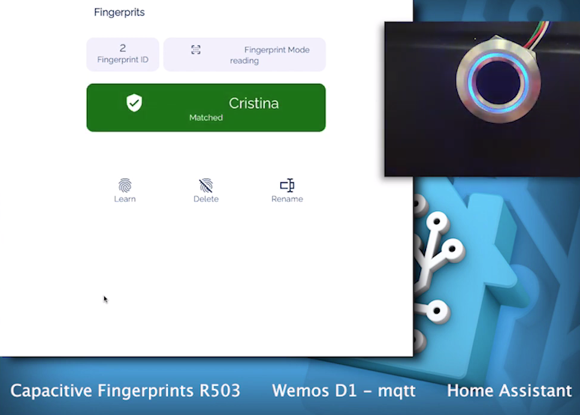
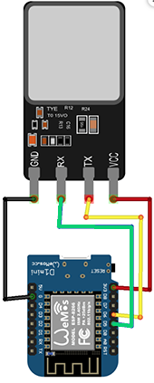
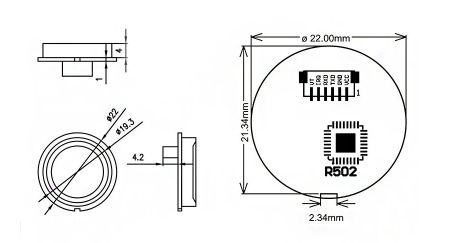

# Fingerprints-reader-R503---R502-esp8266-mqtt-Home-Assistant

## Hardware List

- Capacitive fingerprints R502 - R503
- Esp8266 (wemods D1 mini tested)

## Software List

- idearduino sketch (download from reposity)
- adafruit modified libray (download from reposity)
- PubSubClient – provides the MQTT connectivity (install from idearduino library management)
- ArduinoJSON – provides the framework for sending JSON message to Home Assistant (install from idearduino library management)

## Hardware connections

R503 - R502 cable colors

Red: VCC

Black: GND

Yellow: TX

Green: RX

Blu: not used

White: not used

R502 connection pin:

## GUIDE
Install the necessary [libraries](https://github.com/madmicio/Fingerprints-reader-R503---R502-esp8266-mqtt-Home-Assistant/tree/main/libraries/Adafruit_Fingerprint_Sensor_Library),
download the [sketch](https://github.com/madmicio/Fingerprints-reader-R503---R502-esp8266-mqtt-Home-Assistant/tree/main/sketch/fingerprints-mqtt) and open it with ide arduino.

select your board, edit the file with wifi and mqtt credentials

open the serial monitor. switch your board off and on again.

if everything went well you will have this screen:

## Home Assistant Configuration

install [SAVER](https://github.com/PiotrMachowski/Home-Assistant-custom-components-Saver) integration

Saver is an extraordinary [Piotr Machowski](https://github.com/PiotrMachowski) project, a simple but very powerful tool.
fills a big gap in Home assistant.

the R503 - R 502 sensor stores the fingerprint image and associates it with an id 1-127

in the saver project it is used to store the user name and associate it with the reader id.

copy the [script](https://github.com/madmicio/Fingerprints-reader-R503---R502-esp8266-mqtt-Home-Assistant/tree/main/home_assistant) code in your script-file or in your script section

copy the [sensor](https://github.com/madmicio/Fingerprints-reader-R503---R502-esp8266-mqtt-Home-Assistant/tree/main/home_assistant) code in your script-file or in your script section

## OR

copy [fingerprints_package.yaml](https://github.com/madmicio/Fingerprints-reader-R503---R502-esp8266-mqtt-Home-Assistant/tree/main/home_assistant) in your package folder

## Lovelace

copy [lovelace](https://github.com/madmicio/Fingerprints-reader-R503---R502-esp8266-mqtt-Home-Assistant/tree/main/home_assistant) code in your config
 
 
## this project is totally inspired by [EVERYTHING SMART HOME ](https://everythingsmarthome.co.uk/howto/how-to-build-a-wifi-connected-fingerprint-sensor-with-home-assistant/)
 

